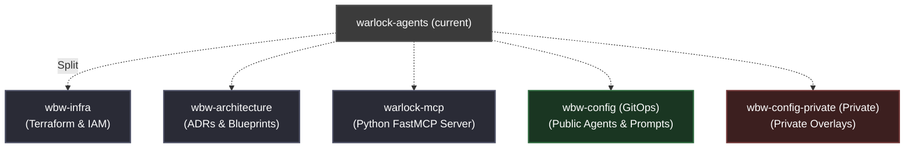

# ADR 0002: Repository Split and GitOps Config Separation for Works-by-Worrell

## Status
*   **Status:** Approved
*   **Author:** Roger Worrell (SSE)
*   **Date:** 2026-07-24

---

## 1. Context & Problem Statement

Currently, the `warlock-agents` repository is a monorepo containing:
1.  **Infrastructure Code (`infra/`)**: Terraform configurations for GCP Native Firestore, Cloud Run, Secret Manager, etc.
2.  **Application Code (`python-app/`)**: FastMCP Python server, endpoints, tools, and local storage clients.
3.  **Architectural Documentation (`docs/architecture/`)**: Blueprints and designs (e.g., `0001-cloud-migration-blueprint.md`).
4.  **Operational Scripts (`.scripts/`, `python-app/scripts/`)**: Ingestion pipeline synchronization scripts.
5.  **Agent/Profile Configurations (`.public/`, `.private/`)**: Markdown-based agent profiles, prompts, and private overlays.

### 1.1 Architectural Drivers & Constraints
*   **Strict $0.00/Month Budget:** Works-by-Worrell runs entirely on cloud provider Free Tiers. No component or automated workflow is allowed to incur active subscription or usage fees.
*   **GCP Free Tier Boundaries:**
    *   *Cloud Run:* 2 million free requests/month, 360,000 GB-seconds memory, 180,000 vCPU-seconds.
    *   *Firestore Native:* 1 GB storage, 50,000 reads/day, 20,000 writes/day, 20,000 deletes/day.
    *   *Artifact Registry:* 500 MB (0.5 GiB) storage.
    *   *Secret Manager:* 6 active secret versions/month.
*   **GitHub Actions Boundaries:** Public repositories get unlimited free action execution runner minutes. Private repositories are capped at 2,000 free minutes/month.

### 1.2 Pain Points
*   **Context Contamination / IDE Clutter:** PyCharm and other IDEs index both the python app, documentation, raw terraform states, and runtime markdown configurations, leading to slower indexing, mixed linting scopes, and dependency noise.
*   **Decoupled Lifecycles:** Infrastructure modifications (Terraform) have a totally different lifecycle and blast radius compared to Python application code (MCP server tool additions) or prompt configuration tweaks.
*   **The "Warlock Agents" Misnomer:** The infra layer supports general Works-by-Worrell (WBW) resources, not just the Warlock Agents project.
*   **Security Risks:** Storing private overlays (`.private/`) in the same physical repository as public application code increases the risk of accidental exposure or leakage of sensitive API keys/tokens during a git push.

---

## 2. Proposed Target Architecture

We propose splitting the single repository into a multi-repository model under the **Works-by-Worrell** GitHub Organization. 

### A. Repository Split



1.  **`wbw-infra`** (GCP Terraform configurations)
    *   *Purpose:* Centralized infrastructure management for the Works-by-Worrell organization.
    *   *Best Practice:* Follows the modular infrastructure-as-code pattern, separating platform-wide resources (IAM, networking) from specific application service lifecycles.
    *   *Branching & Environment Strategy:*
        *   **Default Branch:** `main`. Since both environments are defined on the same branch via directories, `main` acts as the single source of truth.
        *   **Directory-per-Environment:** To prevent config drift between git branches (an SSE anti-pattern), the repository uses a directory-per-environment layout (e.g., `environments/nprd/` and `environments/prod/` calling shared Terraform modules in `modules/`). This allows the `main` branch to host both environments.
        *   **Path-Based Triggering:** CI/CD triggers are configured with path filters (e.g., changes to `environments/nprd/**` trigger non-prod deployment pipelines, and changes to `environments/prod/**` trigger production deployment pipelines), maintaining isolation while keeping a single-branch source of truth.
    *   *Extensibility:* Designed as a reusable platform. Future Works-by-Worrell services (e.g., frontend web clients, background workers) can be provisioned rapidly by creating modular blocks under `modules/` and instantiating them within the existing environment folders without starting GCP setup from scratch.
2.  **`wbw-architecture`** (ADRs & Implementation Blueprints)
    *   *Purpose:* Shared technical documentation, design records, system diagrams, and cross-project decisions.
    *   *Unified Governance:* Serves as a centralized architectural portfolio. Decoupling design records from specific codebases creates a clean, evergreen design archive for all organization projects, allowing for easy cataloging and showcasing of architectural decisions.
3.  **`warlock-mcp`** (FastMCP Python Server)
    *   *Purpose:* Codebase for the MCP server, tools, and Firestore data access layers.
4.  **`wbw-config`** (GitOps Configuration Repo)
    *   *Purpose:* Storing public agent profiles (`.public/agents/`) and prompts. Publicly accessible for visibility and community forkability.
5.  **`wbw-config-private`** (Private GitOps Configuration Repo)
    *   *Purpose:* Storing private operational settings and overlays (`.private/agents/`) securely away from public visibility. Handles automated sync workflows within a secure, zero-trust boundary.

### B. Repository & Code Component Naming Standard

To ensure the codebase is highly maintainable, facilitates clean open-source contributions, and adheres to production-grade design principles without incurring overly verbose enterprise boilerplates (avoiding `WarlockAgentConfigurationManagementSystemSyncCoordinatorImpl`), we establish the following naming conventions:

*   **Repository Naming Schema:** 
    *   Shared/global organizational assets use a `wbw-[concern]` prefix (e.g., `wbw-infra`, `wbw-config`, `wbw-architecture`).
    *   Project-specific runtime services use `[product]-[type]` naming (e.g., `warlock-mcp`).
*   **Package Structure (`worksbyworrell.warlock.*`):**
    *   *Data Access (DAO):* Refactor `firestore_client.py` function-based access into a clear DDD Repository class pattern. Use **`AgentRepository`** (interface/base class) and **`FirestoreAgentRepository`** (concrete implementation) located under `worksbyworrell.warlock.repository`. This provides a clean domain boundary that isolates the application logic from the database driver and implementation details.
    *   *Ingestion Script:* Refactor `sync.py` to live inside `worksbyworrell.warlock.pipeline` as **`AgentConfigIngestionPipeline`**.
    *   *Domain Models (Entities):* Use clean, explicit Pydantic schemas representing domain entities: **`AgentConfiguration`** and **`AgentOverlay`**.
*   **GCP Resource Naming (Terraform):**
    To ensure professional, multi-tenant-ready infrastructure layout, we implement a standardized naming convention: `wbw-[application]-[resource_type]-[environment]`.
    *   *GCS Terraform State Bucket:* `wbw-tf-state-prod` (renamed from generic `worksbyworrell-tf-state`).
    *   *Artifact Registry Repository:* `wbw-global-registry` (shared across the org, rather than generic `worksbyworrell-registry`).
    *   *Cloud Run Service:* `warlock-mcp-prod` (renamed from generic `warlock-agents-core`).
    *   *Secret Manager Secrets:* `warlock-mcp-github-token` (renamed from generic `github-app-token`).
    *   *Service Accounts (Least Privilege):*
        *   GitOps Syncer SA: `wbw-gitops-syncer-sa` (renamed from `github-firestore-sync`).
        *   Cloud Run Runtime SA: `warlock-mcp-runner-sa` (created as a dedicated custom SA, avoiding the default Compute Engine service account security anti-pattern).

---

## 3. Resolving the Unknowns

### Question 1: Where should the migration/sync scripts live?
The synchronization pipeline parses local markdown agents/profiles and pushes them to Firestore collections.

#### Options Evaluated:
1.  **Option A: Inside `warlock-mcp` (as a CLI Utility / Entrypoint)**
    *   *Pros:* Shares Firestore DAO models and schema definitions. If the agent data schema changes, both the sync tool and the server read/write logic are updated and tested in the same PR.
    *   *Cons:* Couples data ingestion tooling with the runtime server code.
2.  **Option B: Inside `wbw-config` (as a GitHub Actions action/script)**
    *   *Pros:* Keeps the execution logic next to the data being changed.
    *   *Cons:* Requires duplicating Firestore client logic or calling the MCP server via an API endpoint.

#### Proposed Decision: **Option A (CLI Utility in `warlock-mcp`)**
We will treat the sync code as a **utility CLI module** within the `warlock-mcp` repository, but package and release it as a lightweight companion Docker container (**`warlock-mcp-syncer`**).
*   **Architectural Alignment:** Keeping schema definitions and database write actions co-located within the main application service repository prevents schema-code drift and guarantees that database modifications are fully validated in local unit and integration tests.
*   **Execution Flow:** The sync script is built as a separate container image (`warlock-mcp-syncer`) during the `warlock-mcp` CI pipeline. When changes are committed to `wbw-config` or `wbw-config-private`, the GitHub Actions workflow simply pulls this pre-built container image, mounts the local Markdown configuration directory, and runs the sync directly. This eliminates the need to checkout application code or install Python virtual environments on every config edit.
*   **$0 Budget Adherence:** The sync utility will calculate MD5 file hashes or utilize git diffs to only perform writes to Firestore when an agent configuration has actually changed. This delta-syncing strategy protects the **Firestore 20,000 writes/day free tier** limit from being exhausted by repeated full-sync builds.

---

### Question 2: Where should the base Agent/Profile markdown documents live?
These are the files that define system prompts, models, and tools for each agent.

#### Proposed Decision: **Centralized Configuration Repos (`wbw-config` and `wbw-config-private`)**
*   **Why:** Storing these in separate repositories decouples prompt engineering and profile updates from code deployments. Changing a system prompt or onboarding a new agent is a config change, not a code release.
*   **GitOps Workflow:**
    ```mermaid
    sequenceDiagram
        autonumber
        actor Dev as Developer / Agent
        participant ConfigRepo as wbw-config (Git)
        participant CI as GitHub Actions (wbw-config)
        participant SyncScript as Sync CLI (warlock-mcp)
        participant Firestore as GCP Firestore

        Dev->>ConfigRepo: Commit changes to public/agents/warlock_prime.md
        ConfigRepo->>CI: Trigger sync workflow
        CI->>SyncScript: Pull sync script & credentials via WIF
        CI->>SyncScript: Run sync (delta sync only)
        SyncScript->>Firestore: Upsert agent_configurations collection
    ```
*   **$0 Budget Adherence & Security:**
    *   `wbw-config` (public config repo): Public repositories get **unlimited free GitHub Actions runner minutes**.
    *   `wbw-config-private` (private overlays repo): Private repositories get **2,000 free runner minutes/month** from GitHub Free Tier, which is more than enough for config updates. This guarantees a secure, zero-trust boundary for API keys/overlays at exactly $0.00 cost.
    *   **Zero-Keys-in-Git Strategy:** To prevent raw credentials from being committed in plain text to the private Git repository, markdown files use env-var placeholders (e.g., `${OPENAI_API_KEY}`). The sync workflow retrieves the actual keys from secure **GitHub Repository Secrets** and injects them in-memory at execution time before writing the resolved document to the Firestore `agent_overlays` collection.
    *   **Local Development Fallback:** For local testing, a local `.env` file (which is gitignored) is used to load keys into the local environment, keeping local runs completely offline.

---

## 4. Other Architectural Considerations (SSE Checklist)

### 1. Zero-Trust CI/CD via Workload Identity Federation (WIF)
*   **Pattern:** Do not use long-lived GCP service account JSON keys inside GitHub secrets.
*   **Implementation:** Configure Google Workload Identity Federation in `wbw-infra` to allow GitHub Actions in both `warlock-mcp` (for container builds) and `wbw-config` (for Firestore sync) to exchange GitHub OIDC tokens for short-lived GCP IAM credentials.

### 2. Firestore Schema & Schema Validations
*   **Pattern:** Enforce schema validation at the ingestion boundary to protect the datastore from corrupted or incomplete payloads using data-parsing libraries (like Pydantic).
*   **Implementation:** Before the sync script writes parsed markdown yaml frontmatter into Firestore, validate it against a Pydantic schema (e.g. `AgentConfigSchema`). This prevents bad markdown files from corrupting the database and crashing the MCP server.

### 3. Local Development Fallbacks (Offline-First Dev loop)
*   **Pattern:** Developers should be able to run the MCP server locally without access to GCP Firestore.
*   **Implementation:** Preserve the existing fallback strategy inside `firestore_client.py`: if `GCP_PROJECT_ID` is not present, fall back to loading from a local mock folder (or run a Firestore emulator). Ensure the sync script has an option to output local `.json` caches for local testing.

### 4. $0 Budget Resource Optimizations
*   **Artifact Registry Image Retention:** Given the highly optimized container image sizes (~72 MB), retaining the recent 3 versions (~216 MB) easily fits within GCP's **500 MB (0.5 GiB) Artifact Registry Free Tier storage**. We leverage the Terraform lifecycle cleanup policy (`delete-untagged-images` and `keep-recent-3-versions`) to enforce this cap automatically.
*   **Scale-to-Zero Cloud Run:** Cloud Run instances are configured with `min_instance_count = 0` and CPU allocation "only during request processing" to prevent idle CPU costs, staying within the **2 million free requests/month** tier.
*   **Secret Manager & Firestore:** GCP Secret Manager is capped at 1 secret (`github-app-token`), staying under the free limit of 6 active secret versions. Custom LLM keys and other developer credentials are loaded in-memory from Firestore's `agent_overlays` collection (which is under the 1 GB free database size limit).

### 5. Multi-Environment Promotion Strategy (Terraform)
*   **Core Principle:** Avoid copy-pasting resource definitions (`main.tf` blocks). We enforce DRY (Don't Repeat Yourself) infrastructure.
*   **How it Works (The Shared Module Pattern):**
    *   Core GCP resources are defined once in `modules/[resource-name]/` (e.g., `modules/warlock-mcp/`).
    *   Environment folders (`environments/nprd/` and `environments/prod/`) contain only:
        1. Backend configuration (`backend.tf`) pointing to the respective environment's state bucket.
        2. Module instantiation referencing the shared module (`source = "../../modules/warlock-mcp"`).
        3. Environment-specific inputs (e.g. `project_id`, `scaling_max_instances = 1` for nprd vs `scaling_max_instances = 3` for prod).
*   **DRY Configuration Pattern:** This maps to the traditional 'build once, configure anywhere' pattern. The module code acts as the immutable infrastructure definition, while the environment directories act as environment-specific configuration overrides.
*   **Promotion Flow:**
    1.  **Develop & Test:** Modify resources inside `modules/warlock-mcp/` or update variables in `environments/nprd/main.tf`. Run `terraform apply` against the `worksbyworrell-nprd` project.
    2.  **Promote to Production:** Once verified in non-prod, update the module inputs or properties inside `environments/prod/main.tf` to match. Run `terraform apply` against the `worksbyworrell-prod` project.

---

## 5. Consequences & Migration Plan

### Positive Impacts
*   **Cleaner IDE indexing:** Developers/Agents working on `warlock-mcp` only see python code, improving linting, test speeds, and focus.
*   **No Code Deployment for Prompts:** Modifying agent behavior (prompts) is done strictly via markdown edits in `wbw-config`, which update Firestore in near real-time via GitOps.
*   **Isolated Security Boundary:** Private settings live in a separate execution boundary, minimizing risk of accidental git pushes.
*   **Platform Extensibility & Future Leverage:** Establishes a highly reusable platform boilerplate. Onboarding future services (whether written in Python, Java, or Node) requires zero reinventing of the wheel. Developers can leverage the pre-configured GCS Terraform state, GitHub Actions OIDC (Workload Identity Federation), Pydantic/YAML config parse structures, and Firestore document seeding routines.
*   **Signal of Production-Grade Competency:** The resulting multi-repo architectural split showcases high-value skills—such as advanced IaC (Terraform modules), secure CI/CD pipelines (WIF), GitOps configurations, and clean domain isolation (DDD)—making it a powerful showcase of senior software engineering capabilities.

### Migration Steps
1.  **Initialize `wbw-infra`:** Migrate `infra/` folder into `wbw-infra` on the `main` branch, and restructure it into `environments/nprd/` (targeting the `worksbyworrell-nprd` GCP project) and `environments/prod/` calling shared modules in `modules/`. Run `terraform init` pointing to the GCS state bucket.
2.  **Initialize `wbw-architecture`:** Migrate `docs/architecture/` and initialize the ADR structure. Refactor and decouple historical developer execution/session notes from core blueprints into the `devlogs/` directory, using filenames that reference the corresponding ADR/Blueprint number and name (e.g., `devlogs/0001-cloud-migration-devlog.md`).
3.  **Initialize `warlock-mcp`:** Clean up python application, configure code testing CI, and publish the sync tool entrypoint.
4.  **Initialize `wbw-config`:** Move `.public/` and configure the GitHub actions sync yaml.
5.  **Deprecate `warlock-agents` monorepo.**
