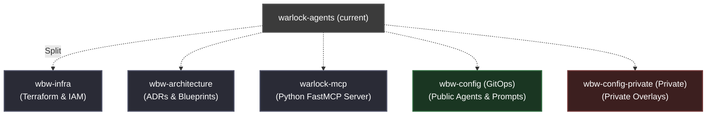

# ADR 0002: Repository Split and GitOps Config Separation for Works-by-Worrell

## Status
*   **Status:** Implemented
*   **Author:** Roger Worrell (SSE)
*   **Date:** 2026-07-24

---

## 1. Context & Problem Statement

Currently, the `warlock-agents` repository is a monorepo containing:
1.  **Infrastructure Code (`infra/`)**: Terraform configurations for GCP Native Firestore, Cloud Run, Secret Manager, etc.
2.  **Application Code (`python-app/`)**: FastMCP Python server, endpoints, tools, and local storage clients.
3.  **Architectural Documentation (`docs/architecture/`)**: Blueprints and designs (e.g., `0001-cloud-migration-blueprint.md`).
4.  **Operational Scripts (`.scripts/`, `python-app/scripts/`)**: Ingestion pipeline synchronization scripts.
5.  **Agent/Profile Configurations (`.public/`, `.private/`)**: Markdown-based agent profiles, prompts, and private overlays.

### 1.1 Architectural Drivers & Constraints
*   **Strict $0.00/Month Budget:** Works-by-Worrell runs entirely on cloud provider Free Tiers. No component or automated workflow is allowed to incur active subscription or usage fees.
*   **GCP Free Tier Boundaries:**
    *   *Cloud Run:* 2 million free requests/month, 360,000 GB-seconds memory, 180,000 vCPU-seconds.
    *   *Firestore Native:* 1 GB storage, 50,000 reads/day, 20,000 writes/day, 20,000 deletes/day.
    *   *Artifact Registry:* 500 MB (0.5 GiB) storage. Requires strict automated retention policies to prune old double-tagged OCI images and prevent billing overages.
    *   *Secret Manager:* 6 active secret versions/month. Non-sensitive operational values (`YOUTRACK_URL`, `YOUTRACK_PROJECT_KEY`) MUST be stored as Cloud Run env vars rather than Secret Manager secrets to preserve active secret version limits.
*   **GitHub Actions Boundaries:** Public repositories get unlimited free action execution runner minutes. Private repositories are capped at 2,000 free minutes/month.
*   **Clean-Slate Infrastructure Strategy:** Greenfield/Early-Stage context allows total destruction and rebuild of GCP Cloud Run services, Secret Manager resources, buckets, and service accounts (excluding GCP Project resource deletion to avoid 30-day soft-delete lockouts).
*   **Production Readiness via Stubs (Separate Projects):** To adhere strictly to the $0.00 budget while demonstrating architectural maturity, production (`prod`) will be defined as a logically separate GCP project (`worksbyworrell-prod`). However, the `prod` project and its resources will **not** be provisioned initially. The IaC folder structures and deployment pipelines for `prod` will exist purely as stubs to prove environment isolation capabilities.

### 1.2 Pain Points
*   **Context Contamination / IDE Clutter:** PyCharm and other IDEs index both the python app, documentation, raw terraform states, and runtime markdown configurations, leading to slower indexing, mixed linting scopes, and dependency noise.
*   **Decoupled Lifecycles:** Infrastructure modifications (Terraform) have a totally different lifecycle and blast radius compared to Python application code (MCP server tool additions) or prompt configuration tweaks.
*   **The "Warlock Agents" Misnomer:** The infra layer supports general Works-by-Worrell (WBW) resources, not just the Warlock Agents project.
*   **Security Risks:** Storing private overlays (`.private/`) in the same physical repository as public application code increases the risk of accidental exposure or leakage of sensitive API keys/tokens during a git push.
*   **Tightly Coupled Filesystem Traversal (`PROJECT_ROOT`):** Python application modules directly access configuration assets via high-risk relative path traversals up to the monorepo root, creating hard filesystem dependencies across all MCP resource endpoints.

---

## 2. Proposed Target Architecture

We propose splitting the single repository into a multi-repository model under the **Works-by-Worrell** GitHub Organization. 

### A. Repository Split



1.  **`wbw-infra`** (GCP Terraform configurations)
    *   *Purpose:* Centralized infrastructure management for the Works-by-Worrell organization.
    *   *Best Practice:* Follows the modular infrastructure-as-code pattern, separating platform-wide resources (IAM, networking) from specific application service lifecycles.
    *   *CI/CD Automation:* Infrastructure is applied exclusively via GitHub Actions workflows utilizing Workload Identity Federation (WIF). Local `terraform apply` executions are strictly prohibited to prevent state drift and credential leakage.
    *   *Branching & Environment Strategy:*
        *   **Default Branch:** `main`. Since both environments are defined on the same branch via directories, `main` acts as the single source of truth.
        *   **Directory-per-Environment:** To prevent config drift between git branches (an SSE anti-pattern), the repository uses a directory-per-environment layout (e.g., `environments/nprd/` and `environments/prod/` calling shared Terraform modules in `modules/`). This allows the `main` branch to host both environments. Note: The `environments/prod/` directory will exist as a **stub** pointing to a separate GCP project (`worksbyworrell-prod`), demonstrating production-readiness without incurring costs.
        *   **Path-Based Triggering:** CI/CD triggers are configured with path filters (e.g., changes to `environments/nprd/**` trigger non-prod deployment pipelines, and changes to `environments/prod/**` trigger production deployment pipelines), maintaining isolation while keeping a single-branch source of truth.
    *   *Extensibility:* Designed as a reusable platform. Future Works-by-Worrell services (e.g., frontend web clients, background workers) can be provisioned rapidly by creating modular blocks under `modules/` and instantiating them within the existing environment folders without starting GCP setup from scratch.
2.  **`wbw-architecture`** (ADRs & Implementation Blueprints)
    *   *Purpose:* Shared technical documentation, design records, system diagrams, and cross-project decisions.
    *   *Unified Governance:* Serves as a centralized architectural portfolio. Decoupling design records from specific codebases creates a clean, evergreen design archive for all organization projects, allowing for easy cataloging and showcasing of architectural decisions.
3.  **`warlock-mcp`** (FastMCP Python Server)
    *   *Purpose:* Codebase for the MCP server, tools, and Firestore data access layers.
4.  **`wbw-config`** (GitOps Configuration Repo)
    *   *Purpose:* Storing public agent profiles (`agents/`), user profiles (`profiles/`), static definition resources (`resources/`), and skill metadata (`skills/`). Publicly accessible for visibility and community forkability.
5.  **`wbw-config-private`** (Private GitOps Configuration Repo)
    *   *Purpose:* Storing private operational settings and overlays (`agents/`, `profiles/`) securely away from public visibility. Handles automated sync workflows within a secure, zero-trust boundary.

### B. Repository & Code Component Naming Standard

To ensure the codebase is highly maintainable, facilitates clean open-source contributions, and adheres to production-grade design principles without incurring overly verbose enterprise boilerplates (avoiding `WarlockAgentConfigurationManagementSystemSyncCoordinatorImpl`), we establish the following naming conventions:

*   **Repository Naming Schema:** 
    *   Shared/global organizational assets use a `wbw-[concern]` prefix (e.g., `wbw-infra`, `wbw-config`, `wbw-architecture`).
    *   Project-specific runtime services use `[product]-[type]` naming (e.g., `warlock-mcp`).
*   **Package Structure (`worksbyworrell.warlock.*`):**
    *   *Data Access (DAO):* Completely decouple storage access from MCP web server decorators. Implement comprehensive DDD Repositories under `worksbyworrell.warlock.repository`:
        *   **`AgentRepository`** (`FirestoreAgentRepository` / `LocalAgentRepository`)
        *   **`UserProfileRepository`** (`FirestoreUserProfileRepository` / `LocalUserProfileRepository`)
        *   **`ResourceRepository`** (`FirestoreResourceRepository` / `LocalResourceRepository`)
        *   **`SkillMetadataRepository`** (`FirestoreSkillMetadataRepository` / `LocalSkillMetadataRepository`)
    *   *Service Layer (Facade Pattern):* Implement orchestration logic under `worksbyworrell.warlock.service` (e.g., **`AgentSessionService`**), which injects repository interfaces to compose multi-domain responses (Agent Persona + User Profile + Skill Metadata) for MCP prompt decorators.
    *   *Ingestion Pipeline:* Refactor `sync.py` to live inside `worksbyworrell.warlock.pipeline` as **`ConfigIngestionPipeline`**, decoupled from FastMCP framework imports.
    *   *Domain Models (Entities):* Use clean, explicit Pydantic schemas representing domain entities: **`AgentConfiguration`**, **`AgentOverlay`**, **`UserProfile`**, and **`SystemResource`**.
*   **GCP Resource Naming (Terraform):**
    To ensure professional, multi-tenant-ready infrastructure layout, we implement a standardized naming convention: `wbw-[application]-[resource_type]-[environment]`.
    *   *GCS Terraform State Bucket:* `wbw-tf-state-prod` (renamed from generic `worksbyworrell-tf-state`).
    *   *Artifact Registry Repository:* `wbw-global-registry` (shared across the org, rather than generic `worksbyworrell-registry`).
    *   *Cloud Run Service:* `warlock-mcp-prod` (renamed from generic `warlock-agents-core`).
    *   *Secret Manager Secrets:* Strictly budget secret versions for credentials (`warlock-mcp-github-token`, `warlock-mcp-youtrack-token`). Inject non-sensitive configs (`YOUTRACK_URL`, `YOUTRACK_PROJECT_KEY`) via standard Cloud Run environment variables.
    *   *Service Accounts (Least Privilege):*
        *   GitOps Syncer SA: `wbw-gitops-syncer-sa` (granted `roles/datastore.user` and `roles/artifactregistry.reader`).
        *   Cloud Run Runtime SA: `warlock-mcp-runner-sa` (created as a dedicated custom SA, avoiding the default Compute Engine service account security anti-pattern).

---

## 3. Resolving Architectural Design Review Findings

### Question 1: Where should the migration/sync scripts live?
The synchronization pipeline parses local markdown assets and pushes them to Firestore collections.

#### Proposed Decision: **Option A (Decoupled Sync Utility CLI in `warlock-mcp`)**
We will treat the sync code as a **utility CLI module** within `warlock-mcp`, packaged as a companion Docker container (**`warlock-mcp-syncer`**).
*   **Decoupled Architecture:** `ConfigIngestionPipeline` and `save_document` helper functions will be strictly isolated from `FastMCP` server instances to prevent transitive framework imports in the CLI utility container.
*   **Comprehensive Sync Scope:** Ingestion pipeline syncs agent specifications (`agent_configurations`, `agent_overlays`), user profiles (`user_profiles`), system resources (`system_resources`), and skill metadata (`skill_metadata`).
*   **Syncer Image Tagging & Release Coordination:** To eliminate broken deployments caused by `:latest` tag drift, `wbw-config` pipelines pin and reference explicit semver/sha image tags (e.g. `warlock-mcp-syncer:v1.2.0`) published by `warlock-mcp` CI releases.
*   **$0 Budget Adherence:** The sync utility will calculate MD5 file hashes or utilize git diffs to only perform writes to Firestore when a configuration asset has actually changed, preserving the **Firestore 20,000 writes/day free tier** limit.

---

### Question 2: Where should base markdown & skill assets live?

#### Proposed Decision: **Centralized Configuration Repos (`wbw-config` and `wbw-config-private`)**
*   **GitOps Workflow:**
    ```mermaid
    sequenceDiagram
        autonumber
        actor Dev as Developer / Agent
        participant ConfigRepo as wbw-config (Git)
        participant CI as GitHub Actions (wbw-config)
        participant SyncScript as Sync CLI (warlock-mcp-syncer)
        participant Firestore as GCP Firestore

        Dev->>ConfigRepo: Commit changes to agents/warlock_prime.md
        ConfigRepo->>CI: Trigger sync workflow (environment-targeted)
        CI->>SyncScript: Authenticate via WIF (with Artifact Registry & Firestore roles)
        CI->>SyncScript: Pull pinned syncer container & run delta sync against target env
        SyncScript->>Firestore: Upsert target Firestore collections
    ```
*   **Dynamic Skills & Executable Code Boundary:** Executable Python tools (`tools.py`) cannot be safely stored in Firestore or dynamically loaded from remote buckets. Python tool implementations are statically registered inside `warlock-mcp`. `wbw-config` stores declarative skill metadata and prompt instructions (`SKILL.md`), which are ingested into Firestore.
*   **Zero-Keys-in-Git Strategy:** Markdown files in `wbw-config-private` use env-var placeholders (e.g., `${OPENAI_API_KEY}`). The sync workflow retrieves actual key values from secure GitHub Repository Secrets, resolving placeholders in-memory prior to writing to Firestore.

---

## 4. Other Architectural Considerations (SSE Checklist)

### 1. Zero-Trust CI/CD via Workload Identity Federation (WIF)
Configure Google Workload Identity Federation in `wbw-infra` allowing GitHub Actions in `warlock-mcp`, `wbw-config`, and `wbw-config-private` to exchange GitHub OIDC tokens for short-lived GCP IAM credentials. Bound IAM roles strictly per target environment (`nprd` vs `prod`). Grant `roles/artifactregistry.reader` to GitHub Actions runner identities in `wbw-config` and `wbw-config-private` to allow pulling pinned syncer images.

### 2. Standardized Environment Detection & Repository Abstraction Layer
Eliminate all runtime `PROJECT_ROOT` path traversals across `agents.py`, `profiles.py`, `definitions.py`, and `skills.py`. Standardize environment detection strictly on `GCP_PROJECT_ID` (injected explicitly via Terraform in Cloud Run). The FastMCP server resolves all resources dynamically through `AgentRepository`, `UserProfileRepository`, `ResourceRepository`, and `SkillMetadataRepository` via `AgentSessionService`.

### 3. GitOps Environment Isolation Strategy
Config sync workflows in `wbw-config` and `wbw-config-private` feature multi-environment awareness:
*   Pushes to `main` targeting `environments/nprd/` or PR branches trigger dry-run validation and non-prod Firestore sync (`worksbyworrell-nprd`).
*   Tagged releases or commits targeting `environments/prod/` execute production Firestore sync (`worksbyworrell-prod`). *(Note: Initially, this prod pipeline step will act as a stub since the prod GCP project is unprovisioned).*

### 4. Milestone Sync Decoupling
Extract `sync_github_milestones_to_firestore()` out of the core agent ingestion path. Milestone data sync runs via a standalone scheduled GitHub Action workflow or webhook handler writing to the `portfolio_milestones` collection.

### 5. Artifact Registry Budget Protection
To prevent the double-tagging container strategy from exceeding the 500MB free tier, `wbw-infra` MUST provision an automated Artifact Registry Cleanup Policy. The policy will retain only Semantic Versions (e.g., `vX.Y.Z`) and the 3 most recent short-SHA tags, aggressively pruning older or untagged images.

### 6. Zero-Burnout Local Dev & Dogfooding (Multi-Repo)
To offset the inherent local development friction of a multi-repo split, the architecture natively supports a "Safe Dogfooding" pattern. Developers configure their MCP clients (e.g., Claude Desktop) with *two* servers:
*   **`warlock-prod`**: Connects remotely to the stable Cloud Run SSE transport.
*   **`warlock-dev`**: Runs locally via `stdio`. It utilizes environment variables (e.g., `WARLOCK_CONFIG_DIR=../wbw-config`) to mount local sister directories, instructing the `LocalAgentRepository` to bypass Firestore entirely and read directly from local disk.
This eliminates CI/CD minute burn and push-to-test latency when iterating on private prompts.

### 7. Versioning & Traceability Strategy
To maintain production-grade traceability across disparate repositories, we will adopt a hybrid versioning model:
*   **Application Services (`warlock-mcp`)**: Strict Semantic Versioning (SemVer 2.0.0). CI pipelines will publish "double-tagged" OCI containers to Artifact Registry containing both the SemVer release tag (e.g., `v1.2.0`) and the short Git commit SHA (e.g., `a1b2c3d`). This provides human readability (SemVer) and strict immutability for deployment rollbacks (short SHA).
*   **GitOps Configurations (`wbw-config`, `wbw-config-private`)**: The "version" is the immutable short Git commit SHA. The `warlock-mcp-syncer` utility will be updated to inject the triggering short `COMMIT_SHA` (e.g., `${GITHUB_SHA::7}`) into the Firestore documents as a `_version_hash` metadata field, providing an exact audit trail of which config version is currently live.
*   **Infrastructure (`wbw-infra`)**: Terraform provider versions and the Terraform CLI binary version MUST be strictly pinned (e.g., `hashicorp/google ~> 5.0`). Reusable modules within the repository rely on the repository's main branch commit history for their state.

---

## 6. Consequences & Migration Plan

### Positive Impacts
*   **Decoupled Filesystem & Clean Runtime:** Eliminates `PROJECT_ROOT` directory traversal vulnerabilities and enables zero-downtime prompt edits via GitOps.
*   **Isolated Execution & Environment Isolation:** Clear separation between non-prod and production Firestore data targets with environment-aware GitOps pipelines.
*   **Robust Domain Model:** Complete DDD Repository and Service Layer abstraction covering all MCP resource endpoints.

### Migration Steps
1.  **Phase 1: Setup Target Repositories:** Provision `wbw-infra`, `wbw-architecture`, `warlock-mcp`, `wbw-config`, and `wbw-config-private`.
2.  **Phase 2: Platform Infrastructure Clean-Slate Rebuild (`wbw-infra`):** Tear down legacy GCP Cloud Run/Secret Manager resources. Provision backend state buckets (`gs://wbw-tf-state-nprd`, `gs://wbw-tf-state-prod`), apply modular Terraform, establish service accounts (with Artifact Registry reader roles), and configure WIF bindings. Clean up orphaned `domain_name` terraform variables.
3.  **Phase 3: Deploy Architectural Governance (`wbw-architecture`):** Migrate ADRs, blueprints, and decouple developer devlogs.
4.  **Phase 4: Refactor & Deploy Application Core (`warlock-mcp`):**
    *   Decouple data access from FastMCP core.
    *   Implement DDD Repositories (`AgentRepository`, `UserProfileRepository`, `ResourceRepository`, `SkillMetadataRepository`).
    *   Implement Service Layer (`AgentSessionService`) for multi-domain prompt composition.
    *   Standardize environment detection on `GCP_PROJECT_ID`.
    *   Refactor `ConfigIngestionPipeline` in `worksbyworrell.warlock.pipeline` covering all config entities.
    *   Build and publish tagged `warlock-mcp` and `warlock-mcp-syncer` containers.
5.  **Phase 5: Deploy GitOps Pipelines (`wbw-config` & `wbw-config-private`):** Populate markdown assets, configure environment-aware sync workflows pulling pinned syncer container tags, and verify Firestore document writes.
6.  **Phase 6: Monorepo Deprecation & Credential Cleanup:** Archive legacy `warlock-agents` monorepo, update `README.md` pointers, revoke legacy `GCP_SA_KEY` secrets, and delete dangling IAM bindings for `github-firestore-sync`.
