# Works-by-Worrell: Repository Split and GitOps Config Separation Migration Blueprint

This migration blueprint defines the REQUIRED operations and patterns to split the current `warlock-agents` monorepo into a multi-repository model under the **Works-by-Worrell** GitHub Organization. This document is aligned with [ADR 0002: Repository Split and GitOps Config Separation](../adrs/0002-repository-split-and-gitops-config-separation.md) and incorporates design review Pass 2 resolution requirements.

All implementation tasks described herein SHALL be executed in accordance with RFC-2119 standards. This blueprint is scoped for execution by a Senior Software Engineer (SSE).

---

## 1. Migration Overview & Dependency Chain

To avoid circular dependencies and guarantee environment isolation, the migration SHALL proceed according to the following phased sequence:

```mermaid
graph TD
    classDef repo fill:#2a2b36,stroke:#4e5166,stroke-width:2px,color:#fff;
    classDef step fill:#1a2336,stroke:#2b4366,stroke-width:2px,color:#fff;

    Step1["Phase 1: Setup Github Repositories"]:::step
    Step2["Phase 2: Deploy wbw-infra (IaC Foundations & Clean-Slate Rebuild)"]:::step
    Step3["Phase 3: Deploy wbw-architecture"]:::step
    Step4["Phase 4: Refactor & Deploy warlock-mcp (Full DDD, Service Layer & Syncer Decoupling)"]:::step
    Step5["Phase 5: Deploy wbw-config & wbw-config-private (Environment-Aware GitOps)"]:::step
    Step6["Phase 6: Monorepo Deprecation & Credential Revocation"]:::step

    Step1 --> Step2
    Step2 --> Step3
    Step2 --> Step4
    Step4 --> Step5
    Step5 --> Step6

    style Step1 fill:#1c2d42,stroke:#3b5c85
```



---

## Phase 1: Target GitHub Repositories Setup

The migration engineer MUST initialize the following five target repositories under the **Works-by-Worrell** organization:
1.  **`wbw-infra`** (Private): REQUIRED to hold Terraform code, environment variables, backend configs, and IAM policies.
2.  **`wbw-architecture`** (Public): REQUIRED to host design records, blueprints, and cross-project decisions.
3.  **`warlock-mcp`** (Public): REQUIRED to house the core FastMCP python server.
4.  **`wbw-config`** (Public): REQUIRED to hold public agent prompt configurations, profiles, and skill metadata.
5.  **`wbw-config-private`** (Private): REQUIRED to store sensitive overlays and credential parameters.

---

## Phase 2: Platform Infrastructure Setup (`wbw-infra`)

### 2.1 Clean-Slate Rebuild Protocol
Given greenfield constraints, the migration engineer SHALL execute a clean-slate teardown of existing GCP resources (excluding GCP project deletion):
1. Execute `terraform destroy` against legacy `infra/` definitions in `warlock-agents`.
2. Delete legacy GCS state bucket `gs://worksbyworrell-tf-state`.
3. Provision new environment state buckets (e.g., `gs://wbw-tf-state-nprd`). *(Note: The `prod` state bucket is deferred, as the `prod` GCP project will not be provisioned initially).*

### 2.2 Reorganize Terraform Folder Structure
To prevent config drift and enforce DRY principles, the repository structure MUST follow a directory-per-environment layout targeting a single default branch (`main`). All environments MUST explicitly pin Terraform binary and provider versions in a `versions.tf` file.

```
wbw-infra/
├── modules/
│   └── warlock-mcp/
│       ├── main.tf           # DRY resource definitions (Cloud Run env & secrets mapping)
│       ├── variables.tf      # CPU/Memory and region inputs
│       └── outputs.tf
└── environments/
    ├── nprd/
    │   ├── main.tf           # Instantiates module/warlock-mcp (Non-Prod)
    │   ├── variables.tf      # Env overrides (e.g. project = worksbyworrell-nprd)
    │   └── backend.tf        # NPRD GCS state backend configuration
    └── prod/                 # STUB: Demonstrates multi-project isolation (Unprovisioned)
        ├── main.tf           # Instantiates module/warlock-mcp (Prod)
        ├── variables.tf      # Env overrides (e.g. project = worksbyworrell-prod)
        └── backend.tf        # PROD GCS state backend configuration
```

### 2.3 Resource Naming, Secret Provisioning & IAM Roles
1.  **Artifact Registry**: Standardized to `wbw-global-registry`.
2.  **Cloud Run Service**: Standardized to `warlock-mcp-nprd` and `warlock-mcp-prod`.
3.  **Secret Manager Secrets vs Env Vars**:
    *   **Secrets**: Provision Secret Manager secrets *only* for sensitive credentials to stay strictly within the 6-version free tier limit:
        * `warlock-mcp-github-token`
        * `warlock-mcp-youtrack-token`
    *   **Environment Variables**: Inject non-sensitive operational settings directly via Cloud Run container environment variables:
        * `GCP_PROJECT_ID` (Required for application strategy resolution)
        * `YOUTRACK_URL`
        * `YOUTRACK_PROJECT_KEY`
        * `FASTMCP_TRANSPORT`
4.  **Artifact Registry Cleanup Policy**: Enforce a Terraform retention policy on `wbw-global-registry` retaining only tags matching semantic version regex and the 3 most recent SHA tags to enforce the 500MB limit.
5.  **Service Accounts & IAM Roles**:
    * **`warlock-mcp-runner-sa`**: Granted `secretmanager.secretAccessor` on credentials and `roles/datastore.user`.
    * **`wbw-gitops-syncer-sa`**: Granted `roles/datastore.user` for Firestore updates AND `roles/artifactregistry.reader` to allow pulling syncer images.
6.  **WIF Trust Policies**: Bind `roles/artifactregistry.reader` to GitHub Actions workflow runner identities for both `wbw-config` and `wbw-config-private`.
7.  **Terraform Automation**: Provision a `.github/workflows/terraform.yml` in `wbw-infra` to execute `terraform plan` on Pull Requests and `terraform apply` on merges to `main` via WIF, enforcing the prohibition of local terraform applies.

---

## Phase 3: Architectural Governance Setup (`wbw-architecture`)

Migrate architectural assets into `wbw-architecture`:
* Extract implementation logs into `devlogs/` referencing ADR/Blueprint numbers (e.g., `devlogs/0001-cloud-migration-devlog.md`).
* Maintain a central index mapping ADR statuses and design docs at the repository root.

---

## Phase 4: Refactor and Deploy Application Core (`warlock-mcp`)

### 4.1 Full Domain-Driven Design (DDD) Repository & Service Layer Refactor
The engineer MUST eliminate all `PROJECT_ROOT` filesystem path traversals across `agents.py`, `profiles.py`, `definitions.py`, and `skills.py`.

1.  **Implement DDD Repositories** under `worksbyworrell.warlock.repository`:
    *   **`AgentRepository`** (`FirestoreAgentRepository`, `LocalAgentRepository`). *Note: The local repositories MUST support overriding target paths via environment variables (e.g., `WARLOCK_CONFIG_DIR`) to enable local sister-directory mounting for dogfooding.*
    *   **`UserProfileRepository`** (`FirestoreUserProfileRepository`, `LocalUserProfileRepository`)
    *   **`ResourceRepository`** (`FirestoreResourceRepository`, `LocalResourceRepository`)
    *   **`SkillMetadataRepository`** (`FirestoreSkillMetadataRepository`, `LocalSkillMetadataRepository`)
2.  **Implement Service Layer (Facade Pattern)** under `worksbyworrell.warlock.service`:
    *   **`AgentSessionService`**: Injects `AgentRepository`, `UserProfileRepository`, and `SkillMetadataRepository` to compose multi-domain prompt sessions (`agent_session()`) cleanly.
3.  **Standardize Environment Strategy Resolution**:
    *   Standardize storage strategy resolution strictly on `GCP_PROJECT_ID`. Do not fallback to `GOOGLE_CLOUD_PROJECT` to prevent strategy resolution split-brain behavior.

### 4.2 Decoupled Ingestion Pipeline & Framework Isolation
* Refactor sync logic into `ConfigIngestionPipeline` inside `worksbyworrell.warlock.pipeline`.
* **Zero FastMCP Dependency:** `ConfigIngestionPipeline` and `save_document` database helpers MUST NOT import `FastMCP` instances or server modules.
* **Expanded Ingestion Scope & Schema Normalization:** Ingest agent specs (`agent_configurations`, `agent_overlays`), user profiles (`user_profiles`), system resources (`system_resources`), and skill metadata (`skill_metadata`). Enforce canonical snake_case document key naming.
* **MD5 Delta-Syncing:** Calculate MD5 checksums of files and write updates only when document hashes drift.

### 4.3 Container Packaging & Pinned Image Tags (Double-Tagging)
The build pipeline MUST implement "double-tagging" for OCI image publishes to Artifact Registry. Every successful release MUST publish two image targets tagged with both the Semantic Version and the short Git SHA (e.g., `warlock-mcp:v1.2.0` AND `warlock-mcp:a1b2c3d`).
1. `warlock-mcp` (Runtime server)
2. `warlock-mcp-syncer` (Standalone sync CLI)

---

## Phase 5: Establish GitOps Configuration Pipelines (`wbw-config` & `wbw-config-private`)

### 5.1 Repository Folder Layout
Both config repos MUST mirror the following layout:
```
wbw-config/
├── agents/        # Markdown agent personas
├── profiles/      # Markdown user profiles
├── resources/     # System markdown definitions (e.g. DEFINITION_OF_READY.md)
└── skills/        # SKILL.md metadata files
```

### 5.2 Environment-Aware GitOps Workflows
Both config repositories MUST define `.github/workflows/sync.yml`:
1.  **Authentication & Image Pull:** Authenticate via WIF (obtaining `roles/artifactregistry.reader`), pull strictly pinned image `warlock-mcp-syncer:vX.Y.Z` (never `:latest`).
2.  **Metadata Injection:** The workflow MUST pass the current short `$GITHUB_SHA` (e.g., `${GITHUB_SHA::7}`) to the syncer CLI to attach to Firestore documents as `_version_hash` for strict config traceability.
2.  **Validation Step:** Execute pre-sync schema linting and Pydantic validation checks on PRs.
3.  **Environment Isolation:**
    *   Changes targeting non-prod branches execute sync against `worksbyworrell-nprd` Firestore.
    *   Changes targeting `main` releases execute sync against `worksbyworrell-prod` Firestore. *(Note: This is a stub configuration initially, as the prod project is unprovisioned).*

---

## Phase 6: Monorepo Deprecation & Credential Revocation

1. Archive `warlock-agents` monorepo.
2. Update `README.md` with pointers to the target repositories.
3. **Credential Revocation**:
   * Delete legacy `GCP_SA_KEY` secret from GitHub repository secrets.
   * Disable and delete legacy service account `github-firestore-sync` in GCP IAM.
   * Remove dangling WIF provider bindings referencing `Works-by-Worrell/warlock-agents`.

---

## Phase 7: Local Developer Experience (Dogfooding) Setup

To establish the zero-burnout multi-repo workflow:
1. Initialize local workspaces cloning all repositories as sister directories (e.g., `~/Source/WBW/warlock-mcp`, `~/Source/WBW/wbw-config`).
2. Configure the primary MCP Client (Claude Desktop / CLI) to load **both** a `warlock-prod` (pointing to the live Cloud Run SSE endpoint) and a `warlock-dev` (pointing to the local `warlock-mcp` repo via `stdio`).
3. Inject the `WARLOCK_CONFIG_DIR` and `WARLOCK_PRIVATE_CONFIG_DIR` environment variables into the `warlock-dev` MCP configuration block, pointing to the local absolute paths of the sister config repositories.

---

## 8. Verification & Validation Checklist

| Phase | Item | Verification Command / Check | Expected Result |
| :--- | :--- | :--- | :--- |
| **Phase 2** | Clean-Slate IaC | `terraform apply` in `environments/nprd/` | Clean build of all resources; Cloud Run receives `GCP_PROJECT_ID` env var. |
| **Phase 2** | IAM Permissions | `gcloud storage buckets get-iam-policy` / WIF policy check | `wbw-gitops-syncer-sa` and WIF bindings contain Artifact Registry reader role. |
| **Phase 4** | DDD & Service Layer Coverage | `pytest tests/unit/` | Unit tests verify zero `PROJECT_ROOT` path calls in resource endpoints via `AgentSessionService`. |
| **Phase 4** | Strategy Resolution Check | Execute container with `GCP_PROJECT_ID` set vs unset | Resolves `FirestoreAgentRepository` cleanly when set; falls back to `LocalAgentRepository` when unset. |
| **Phase 4** | Decoupled Syncer Import | `python -c "import worksbyworrell.warlock.pipeline"` | Module loads cleanly without triggering FastMCP server instantiation. |
| **Phase 5** | GitOps Multi-Collection Sync | Push update to `wbw-config/profiles/raworre.md` | Target Firestore `user_profiles` document updates cleanly via pinned syncer container. |
| **Phase 5** | Non-Prod Isolation | Trigger nprd sync workflow | Non-prod Firestore updates; production Firestore remains unmodified. |
| **Phase 6** | Credential Cleanup | `gcloud iam service-accounts list` | Legacy `github-firestore-sync` SA is deleted; `GCP_SA_KEY` revoked. |
