# Works-by-Worrell: Repository Split and GitOps Config Separation Migration Blueprint

This migration blueprint defines the REQUIRED operations and patterns to split the current `warlock-agents` monorepo into a multi-repository model under the **Works-by-Worrell** GitHub Organization. This document is aligned with [ADR 0002: Repository Split and GitOps Config Separation](../adrs/0002-repository-split-and-gitops-config-separation.md) and builds upon [ADR 0001: Cloud Migration Blueprint](../adrs/0001-cloud-migration-blueprint.md).

All implementation tasks described herein SHALL be executed in accordance with RFC-2119 standards. This blueprint is scoped for execution by a Senior Software Engineer (SSE).

---

## 1. Migration Overview & Dependency Chain

To avoid circular dependencies, the migration SHALL proceed according to the following phased sequence:

```mermaid
graph TD
    classDef repo fill:#2a2b36,stroke:#4e5166,stroke-width:2px,color:#fff;
    classDef step fill:#1a2336,stroke:#2b4366,stroke-width:2px,color:#fff;

    Step1["Phase 1: Setup Github Repositories"]:::step
    Step2["Phase 2: Deploy wbw-infra (IaC Foundations)"]:::step
    Step3["Phase 3: Deploy wbw-architecture"]:::step
    Step4["Phase 4: Refactor & Deploy warlock-mcp"]:::step
    Step5["Phase 5: Deploy wbw-config & wbw-config-private"]:::step
    Step6["Phase 6: Monorepo Deprecation"]:::step

    Step1 --> Step2
    Step2 --> Step3
    Step2 --> Step4
    Step4 --> Step5
    Step5 --> Step6

    style Step1 fill:#1c2d42,stroke:#3b5c85
```



---

## Phase 1: Target GitHub Repositories Setup

The migration engineer MUST initialize the following five target repositories under the **Works-by-Worrell** organization:
1.  **`wbw-infra`** (Private): REQUIRED to hold Terraform code, environment variables, backend configs, and IAM policies.
2.  **`wbw-architecture`** (Public): REQUIRED to host design records, blueprints, and cross-project decisions.
3.  **`warlock-mcp`** (Public): REQUIRED to house the core FastMCP python server.
4.  **`wbw-config`** (Public): REQUIRED to hold public agent prompt configurations.
5.  **`wbw-config-private`** (Private): REQUIRED to store sensitive overlays and credential parameters.

---

## Phase 2: Platform Infrastructure Setup (`wbw-infra`)

The engineer MUST migrate the `infra/` folder contents to the new `wbw-infra` repository and restucture it.

### 2.1 Reorganize Terraform Folder Structure
To prevent config drift and enforce DRY principles, the repository structure MUST follow a directory-per-environment layout targeting a single default branch (`main`):

```
wbw-infra/
├── modules/
│   └── warlock-mcp/
│       ├── main.tf           # DRY resource definitions
│       ├── variables.tf      # CPU/Memory and region inputs
│       └── outputs.tf
└── environments/
    ├── nprd/
    │   ├── main.tf           # Instantiates module/warlock-mcp (Non-Prod)
    │   ├── variables.tf      # Env overrides (e.g. project = wbw-nprd)
    │   └── backend.tf        # NPRD GCS state backend configuration
    └── prod/
        ├── main.tf           # Instantiates module/warlock-mcp (Prod)
        ├── variables.tf      # Env overrides (e.g. project = wbw-prod)
        └── backend.tf        # PROD GCS state backend configuration
```

### 2.2 Rename Resources & Establish Least Privilege Service Accounts
Resource names MUST be refactored to align with the standard schema (`wbw-[application]-[resource_type]-[environment]`):

1.  **State Buckets**:
    *   NPRD: `wbw-tf-state-nprd`
    *   PROD: `wbw-tf-state-prod` (renamed from generic `worksbyworrell-tf-state` in [main.tf:L4](file:///home/raworre/Source/WBW/warlock-agents/infra/main.tf#L4)).

#### 2.2.1 GCS Backend Bootstrapping (CLI Bootstrapping)
To resolve the Terraform state remote backend dependency before initialization, the migration engineer MUST manually provision the GCS backend buckets using `gcloud storage`. Running `terraform init` with a remote backend requires the target bucket to exist beforehand.

Execute the following commands to provision the buckets:
```bash
# Provision the Non-Production State Bucket
gcloud storage buckets create gs://wbw-tf-state-nprd \
    --project=worksbyworrell-nprd \
    --location=us-central1 \
    --uniform-bucket-level-access

# Provision the Production State Bucket
gcloud storage buckets create gs://wbw-tf-state-prod \
    --project=worksbyworrell-prod \
    --location=us-central1 \
    --uniform-bucket-level-access
```

2.  **Artifact Registry**: Rename generic `worksbyworrell-registry` in [main.tf:L53](file:///home/raworre/Source/WBW/warlock-agents/infra/main.tf#L53) to `wbw-global-registry`.
3.  **Cloud Run Service**: Rename `warlock-agents-core` in [main.tf:L79](file:///home/raworre/Source/WBW/warlock-agents/infra/main.tf#L79) to `warlock-mcp-prod` / `warlock-mcp-nprd`.
4.  **Secret Manager Secret**: Rename `github-app-token` in [main.tf:L124](file:///home/raworre/Source/WBW/warlock-agents/infra/main.tf#L124) to `warlock-mcp-github-token`.
5.  **Service Accounts (Least Privilege)**:
    *   The engineer MUST NOT use the default Compute Engine service account for Cloud Run execution.
    *   Create **`warlock-mcp-runner-sa`** (Cloud Run Service Account):
        *   MUST be granted `roles/secretmanager.secretAccessor` strictly on the secret `warlock-mcp-github-token`.
        *   MUST be granted `roles/datastore.user` to query agent collections in GCP Firestore.
    *   Create **`wbw-gitops-syncer-sa`** (GitOps Sync CLI Service Account):
        *   MUST be granted `roles/datastore.user` to allow writes/deletes during GitOps runs.

### 2.3 Configure Workload Identity Federation (WIF)
The engineer MUST NOT use long-lived GCP service account JSON credentials inside GitHub secrets.
*   Workload Identity Federation MUST be configured in `wbw-infra` to allow GitHub Actions in both `warlock-mcp` (for container builds) and `wbw-config` (for Firestore sync) to exchange GitHub OIDC tokens for short-lived GCP IAM credentials.
*   Restrict the WIF provider trust policy specifically to the GitHub repositories: `Works-by-Worrell/warlock-mcp`, `Works-by-Worrell/wbw-config`, and `Works-by-Worrell/wbw-config-private`.

### 2.4 Apply $0.00 Budget Resource Optimizations
*   **Scale-to-Zero**: Cloud Run services MUST be configured with `min_instance_count = 0` and CPU allocation set to "only during request processing" to avoid charges.
*   **Artifact Registry Cleanup Policy**: The repository MUST define a cleanup policy retaining only the 3 most recent versions and automatically deleting untagged images to stay below the 500 MB Free Tier limit.

---

## Phase 3: Architectural Governance Setup (`wbw-architecture`)

The engineer SHALL migrate architectural assets located in [docs/](file:///home/raworre/Source/WBW/warlock-agents/docs) (including [0001-cloud-migration-blueprint.md](file:///home/raworre/Source/WBW/warlock-agents/docs/architecture/0001-cloud-migration-blueprint.md)) into `wbw-architecture`.

### 3.1 Blueprint Refactoring and Devlog Decoupling
To maintain clean design definitions in the architectural portfolio, the engineer MUST extract all developer-specific execution logs ("Implementation & Deployment Session Notes" or "Design & Architectural Decision Notes") out of [0001-cloud-migration-blueprint.md](file:///home/raworre/Source/WBW/warlock-agents/docs/architecture/0001-cloud-migration-blueprint.md).
*   These operational logs (e.g., WSL2 container socket bind locations, local mock data testing configs, Uvicorn CLI flags) MUST NOT be stored within core design blueprints.
*   These details MUST be relocated to the `devlogs/` directory of the `wbw-architecture` repository.
*   The generated devlog filenames MUST reference the corresponding ADR/Blueprint number and name they implement (e.g., `devlogs/0001-cloud-migration-devlog.md`).
*   A central index mapping ADR statuses and design docs SHALL be created at the root of the `wbw-architecture` repository.

---

## Phase 4: Refactor and Deploy Application Core (`warlock-mcp`)

The python codebase in [python-app/](file:///home/raworre/Source/WBW/warlock-agents/python-app) and related synchronizer utilities MUST be migrated to the `warlock-mcp` repository.

### 4.1 Implement Domain-Driven Design (DDD) Repository Pattern
The engineer MUST refactor the direct procedural Firestore calls in [firestore_client.py](file:///home/raworre/Source/WBW/warlock-agents/python-app/src/worksbyworrell/warlock/storage/firestore_client.py) into a DDD Repository Pattern.

> [!NOTE]
> **Java Analog:** This pattern mirrors the Spring Data JPA `Repository` pattern or a classic Java DAO interface, separating the database access client from business service logic.

*   Define abstract base class:
    ```python
    # worksbyworrell/warlock/repository/base.py
    from abc import ABC, abstractmethod
    from worksbyworrell.warlock.domain.models import AgentConfiguration

    class AgentRepository(ABC):
        @abstractmethod
        def get_agent_config(self, agent_id: str) -> AgentConfiguration:
            pass

        @abstractmethod
        def save_agent_config(self, agent_config: AgentConfiguration) -> None:
            pass
    ```
*   Implement concrete class `FirestoreAgentRepository` mapping storage tasks to GCP Firestore.
*   Implement concrete class `LocalAgentRepository` acting as an offline mock database.
*   A factory method MUST resolve the active implementation based on environment variables:
    *   If `GCP_PROJECT_ID` is present: instantiate `FirestoreAgentRepository`.
    *   If `GCP_PROJECT_ID` is absent: fallback to `LocalAgentRepository` loading JSON mock data from `tests/mock_data/`.

### 4.2 Enforce Domain Schema Validation via Pydantic
Direct dictionary manipulations of agent settings SHOULD NOT be used.
*   The application MUST enforce schema validations at the data boundaries using Pydantic models.
*   Define **`AgentConfiguration`** representing public settings.
*   Define **`AgentOverlay`** representing private parameters (e.g. LLM credentials, system overrides).

### 4.3 Refactor the Sync CLI Utility
Refactor [sync.py](file:///home/raworre/Source/WBW/warlock-agents/python-app/src/worksbyworrell/warlock/sync.py) as a CLI module `AgentConfigIngestionPipeline` under `worksbyworrell.warlock.pipeline`.
*   **Delta-Syncing**: To prevent exceeding the **20,000 writes/day free tier** limit on Firestore, the ingestion pipeline MUST calculate MD5 checksums of the local configuration files.
*   This MD5 hash value MUST be saved as a field (`config_hash`) in the Firestore target document.
*   The ingestion pipeline MUST compare local hashes against remote document hashes, executing write updates ONLY when data drift is detected.

### 4.4 Package Companion Docker Container (`warlock-mcp-syncer`)
The builder pipeline MUST output two container targets:
1.  `warlock-mcp`: The runtime FastMCP server.
2.  `warlock-mcp-syncer`: A lightweight companion CLI utility container executing `AgentConfigIngestionPipeline`.

### 4.5 Set up `warlock-mcp` CI/CD Workflow
The repository MUST define a `.github/workflows/deploy.yml` pipeline:
1.  Tests Python code using `pytest`.
2.  Authenticates to GCP using Workload Identity Federation (WIF).
3.  Builds and pushes both `warlock-mcp` and `warlock-mcp-syncer` containers to `wbw-global-registry`.
4.  Deploys the server to Cloud Run (`warlock-mcp-prod` / `warlock-mcp-nprd`).

---

## Phase 5: Establish GitOps Configuration Pipelines

Initialize public configuration settings in `wbw-config` and private overlays in `wbw-config-private`.

### 5.1 Repository Folder Layouts
*   **`wbw-config`** (Public): MUST contain public agent specifications in `agents/`.
*   **`wbw-config-private`** (Private): MUST contain private overlays in `agents/`.

### 5.2 Zero-Keys-in-Git Strategy
Developers MUST NOT commit raw tokens or private credentials to git.
*   Private configuration markdown files MUST use env var placeholder templates, e.g.:
    ```yaml
    ---
    agent_id: warlock_prime
    openai_api_key: ${OPENAI_API_KEY}
    ---
    ```
*   The actual key values MUST be stored securely in the private repository's GitHub Secrets.
*   The sync workflow MUST read and inject these secrets as environment variables into the CLI execution environment.
*   `AgentConfigIngestionPipeline` MUST resolve placeholder parameters in-memory before writing the validated payloads to the Firestore database.

### 5.3 Configure GitOps Workflows
Both config repositories MUST define a `.github/workflows/sync.yml` workflow:
1.  Triggered on commit pushes to the `main` branch affecting paths under `agents/**`.
2.  Retrieve short-lived OIDC tokens for `wbw-gitops-syncer-sa` via WIF.
3.  Pull the `warlock-mcp-syncer` companion container image from `wbw-global-registry`.
4.  Execute the container, mounting local configuration files, and sync changes directly to Firestore.

---

## Phase 6: Monorepo Deprecation

Once verification checks succeed, the engineer SHALL deprecate the legacy `warlock-agents` monorepo:
1.  Archive the `warlock-agents` repository.
2.  Add a deprecation notice to its `README.md` containing links to the new modular projects.

---

## 7. Verification & Validation Checklist

The migration engineer MUST execute the following validation steps at each migration checkpoint:

| Phase | Item | Verification Steps / Command | Expected Result |
| :--- | :--- | :--- | :--- |
| **Phase 2** | WIF Authentication | `gcloud iam service-accounts get-iam-policy wbw-gitops-syncer-sa` | Policy bindings contain GitHub repository OIDC mapping. |
| **Phase 2** | Terraform Dry-Run | `terraform plan` inside `environments/nprd/` | Compilation succeeds, no resource conflicts, names match standard schema. |
| **Phase 4** | Domain Model Tests | `pytest tests/` | All unit tests pass, verifying DDD `AgentRepository` abstraction. |
| **Phase 4** | Offline Fallback | Execute application locally with empty `GCP_PROJECT_ID`. | System falls back to offline `LocalAgentRepository` reading test files. |
| **Phase 5** | GitOps Sync Pipeline | Push change to `wbw-config/agents/warlock_prime.md` | Action completes successfully; document updates in Firestore database. |
| **Phase 5** | Secret Injection | Inspect target Firestore document fields for secret key values. | Key fields show resolved secrets without trace in GitHub commit logs. |

---

## 8. Rollback Protocol

If a blocking incident occurs, the engineer SHALL revert components to their pre-migration states using this rollback protocol:

1.  **Disable GitOps Syncing**: Rename `.github/workflows/sync.yml` to `sync.yml.disabled` in the config repositories.
2.  **Restore Cloud Run Target**: Point the Cloud Run deployment back to the legacy monorepo `warlock-agents-core` image.
3.  **Restore Secrets**: Revert secrets references in Cloud Run to target legacy `github-app-token`.
4.  **Audit Firestore Data**: Ensure collection documents have not been corrupted. If required, execute manual correction scripts or restore collections from backup.
