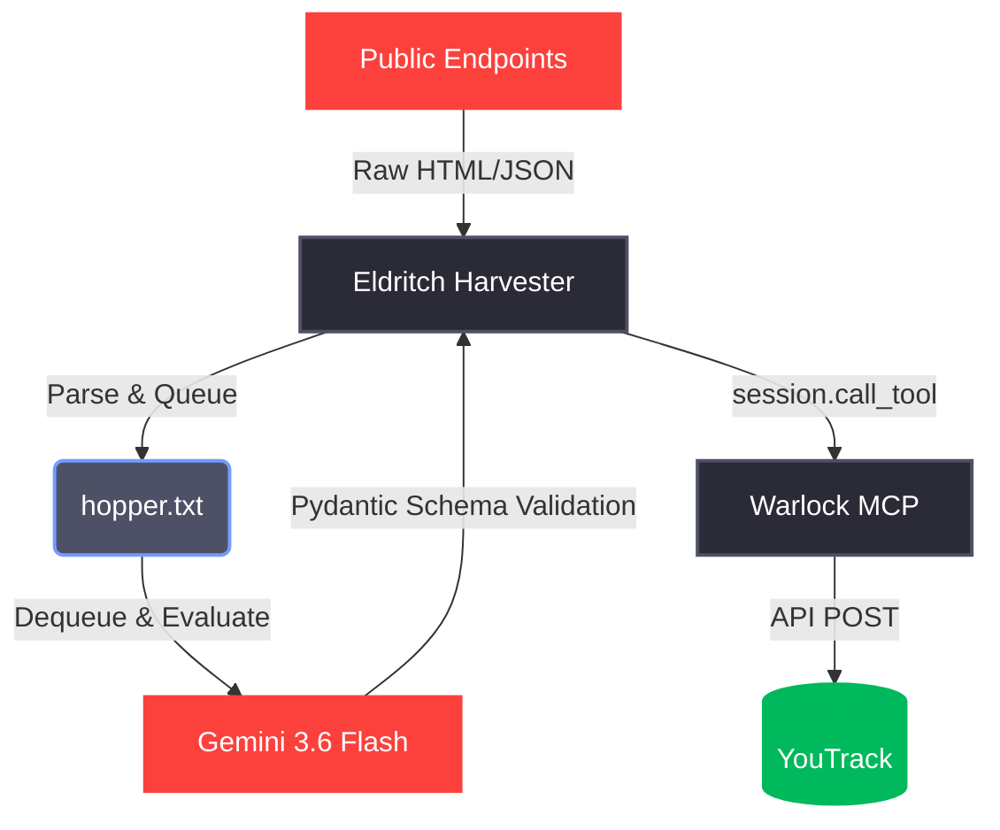

# Works-by-Worrell: Eldritch Harvester Pipeline Blueprint

This migration blueprint defines the REQUIRED operations and patterns to decouple the autonomous data ingestion and evaluation engine into the `eldritch-harvester` repository. This document is aligned with [ADR 0003: Decoupled Eldritch Harvester Pipeline](../adrs/0003-eldritch-harvester-pipeline.md).

All implementation tasks described herein SHALL be executed in accordance with RFC-2119 standards. 

---

## 1. Migration Overview & Dependency Chain

The pipeline extracts data from public endpoints, queues it locally, evaluates it using an LLM, and persists results via the Warlock MCP.

## 2. Task Matrix

| ID Format | Sub-Code | Domain | Covers |
|-----------|----------|--------|--------|
| **P1-R1** | R = Repository | Git Hygiene | Create `eldritch-harvester` GitHub repository, init `README.md`, `.gitignore`. |
| **P1-E1** | E = Environment | `uv` Config | Initialize `uv`, install `httpx`, `beautifulsoup4`, `google-genai`, `pydantic`. |
| **P2-M1** | M = Migration | Script Decoupling | Move `nightly_evaluator.py` into the new repo, adapt imports. |
| **P2-M2** | M = Migration | Queue Management | Relocate `hopper.txt` and ensure idempotent reading/writing. |
| **P3-I1** | I = Integration | Warlock MCP | Configure MCP client to connect to `warlock-mcp` (local or prod). |

