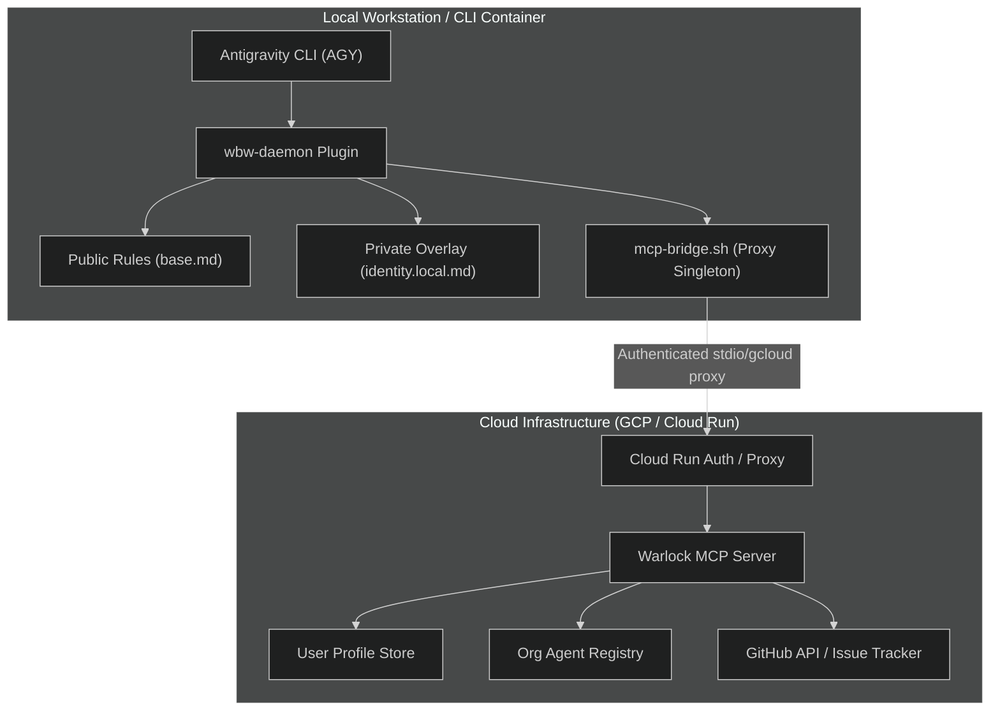

# Blueprint 0006: Cloud-Native Agentic Governance & Layered Identity Architecture Presentation Deck
**Status:** Blueprint Draft  
**Author:** Hrothgar Warlock (Principal Architect) & Daemon (Root Orchestrator)  
**Organization:** Works-by-Worrell  
**Target Audience:** Enterprise Software Architects, AI Platform Engineers, & Open Source Engineering Leads  

---

## 1. Executive Summary

As AI agent frameworks transition from conversational prototypes to autonomous coding assistants, enterprise engineering organizations face two major systemic challenges:
1. **Context & Identity Leakage:** Blending proprietary enterprise context (credentials, private profile details, internal specs) with open-source rules leads to security vulnerabilities and compliance breaches.
2. **Brittle Execution & Drift:** Unanchored CLI agents operating directly in local shell environments suffer from directory drift, un-governed side effects, and lack of deterministic pre-flight initialization.

This document outlines the architecture of **Works-by-Worrell's Cloud-Native Agentic Governance Engine**, combining:
- **`warlock-mcp`**: A Cloud Run-hosted Model Context Protocol (MCP) server providing centralized user profiles, organization agent definitions, and Definition-of-Ready policy enforcement.
- **`wbw-daemon`**: A deterministic agent orchestration plugin and launcher that injects runtime boundaries, manages proxy singletons, and enforces Human-in-the-Loop (HitL) authorization.
- **Layered Profile Architecture**: Strict separation of base open-source rules (`base.md`) and local/private operator overlays (`identity.local.md`, `wbw-config-private`).

---

## 2. System Architecture Blueprint



---

## 3. Core Architectural Pillars

### Pillar A: Centralized Cloud-Native MCP (`warlock-mcp`)
- **Centralized Context Resolution:** Replaces brittle local CLI execution (`gh`, `git`) with explicit MCP contracts (`fetch_user_profile`, `fetch_org_agent`, `evaluate_project_fit`).
- **Policy Enforcement at Boundary:** Enforces organizational Definition-of-Ready guidelines before work can be dispatched to subagent swarms.
- **Dynamic Identity Synthesis:** Merges global organization rules with operator-specific profiles dynamically upon request.

### Pillar B: Layered Identity & Privacy Boundaries
- **Public Core (`base.md` / `wbw-daemon` OSS repo):** Distributable open-source daemon logic, operational workflows, and baseline engineering persona.
- **Private Overlay (`identity.local.md` / `wbw-config-private`):** Git-ignored, encrypted local overlays containing operator preferences, neuro-cognitive communication styling, private credentials, and organizational secrets.
- **Zero-Knowledge Distribution:** Open-source contributors can clone and execute the daemon without gaining access to internal enterprise contexts.

### Pillar C: Deterministic Launcher & Proxy Bridge (`bin/wbw-daemon`)
- **Pre-Flight Authentication:** Automatically checks `gcloud auth print-access-token` prior to booting agent interactive sessions.
- **Proxy Singleton Guard:** Uses PID lockfiles in `mcp-bridge.sh` to eliminate port collisions and zombie `gcloud run services proxy` processes.
- **Automatic Identity Bootstrapping:** Executes sidecar MCP calls *before* agent initialization to hydrate system context instantly.

### Pillar D: Execution Gateway & HitL Safeguards
- **Dual-Layer Execution Boundary:** Subagents operate in read/plan mode; Daemon acts as the sole execution layer to persist changes and run bash operations.
- **Interactive Breakpoints (`ask_question`):** Destructive shell commands, Git pushes, and file mutations require explicit HitL approval via structural terminal prompts.

---

## 4. Presentation Slide Deck Outline

### Slide 1: Title Slide
- **Title:** Enterprise Agent Governance: Cloud-Native MCP & Layered Profiles
- **Subtitle:** Decoupling Proprietary Context, Enforcing HitL Boundaries, and Automating Deterministic Agent Bootstraps
- **Presenter:** Hrothgar Warlock (Founder / Principal Architect, Works-by-Worrell)

### Slide 2: The Enterprise AI Agent Dilemma
- **The Challenge:** How to give AI coding assistants deep context without leaking secrets or producing chaotic, ungoverned code changes.
- **Key Pain Points:**
  - Brittle directory-based shell commands.
  - Secret leakage in shared prompt files / rule sets.
  - Unchecked filesystem mutations and git branch corruption.

### Slide 3: The Architecture — Cloud-Native MCP + Local Plugin
- Visual diagram showing `Antigravity CLI` -> `wbw-daemon` -> `mcp-bridge.sh` -> `Cloud Run Warlock MCP`.
- Key Highlight: Context stays in the cloud; execution stays in governed local sandboxes.

### Slide 4: Layered Identity Architecture (Public vs Private)
- **Base Rule Layer (`base.md`):** Zero-fluff, Root Orchestrator role definition, GitOps rules, standard subagent routing.
- **Local Private Overlay (`identity.local.md`):** Operator communication styling ("Meat & Salt" pragmatism, AuDHD interaction constraints, zero-bullshit preferences), internal API tokens.
- **Result:** Seamless OSS collaboration + total enterprise confidentiality.

### Slide 5: The Bootstrap Engine (`install.sh` & `mcp-bridge.sh`)
- Zero-touch developer onboarding: Run `install.sh`, auto-link `.agents/plugins/wbw-daemon`.
- Singleton lockfile protection against zombie Cloud Run proxy tunnels.
- Pre-flight auth checks ensuring tokens are refreshed before the session starts.

### Slide 6: HitL Governance & The Execution Gateway Pattern
- **Subagents Plan, Daemon Executes:** Agents cannot run `rm -rf` or arbitrary pushes directly.
- **Structural Breakpoints (`ask_question`):** Requiring clear interactive confirmation before touching files or repositories.
- **Telemetry & Definition of Ready:** Tracking issues directly via Warlock MCP prior to subagent invocation.

### Slide 7: Live Demonstration & Operational Impact
- Walkthrough of the bootstrap launch sequence: `bin/wbw-daemon` -> AGY CLI startup -> Profile auto-fetch -> Ready state.
- **Success Verification (as of 2026-08-08):** Repeated the `wbw-daemon` startup script at least three times successfully (confirmed by Cloud Run logs; logs to be pulled later).
- Metrics: Zero secret exposures, 100% deterministic prompt initialization, instantaneous session boot.

---

## 5. Technical Implementation Code Highlights

### Highlights 1: Plugin Definition (`wbw-daemon/plugin.json`)
```json
{
  "name": "wbw-daemon",
  "version": "1.0.0",
  "description": "Root Orchestrator plugin for Works-by-Worrell agentic workflows."
}
```

### Highlights 2: MCP Bridge Singleton Guard (`wbw-daemon/bin/mcp-bridge.sh`)
```bash
#!/usr/bin/env bash
# Ensures single instance of gcloud run proxy on port 8080
LOCKFILE="/tmp/wbw-mcp-bridge.lock"
if [ -e "$LOCKFILE" ]; then
    PID=$(cat "$LOCKFILE")
    if kill -0 "$PID" 2>/dev/null; then
        echo "Proxy already running under PID $PID"
        exit 0
    fi
fi
echo $$ > "$LOCKFILE"
exec gcloud run services proxy warlock-mcp --port=8080
```

---

## 6. Summary & Next Steps
1. **Publish Presentation Deck:** Present to enterprise architecture groups and open-source AI developer communities.
2. **Open Source Core:** Publish `wbw-daemon` public rules as an open-source template for Antigravity plugin developers.
3. **Expand Warlock MCP Tools:** Port remaining GitHub CLI & GitOps telemetry handlers directly into Cloud Run services.
